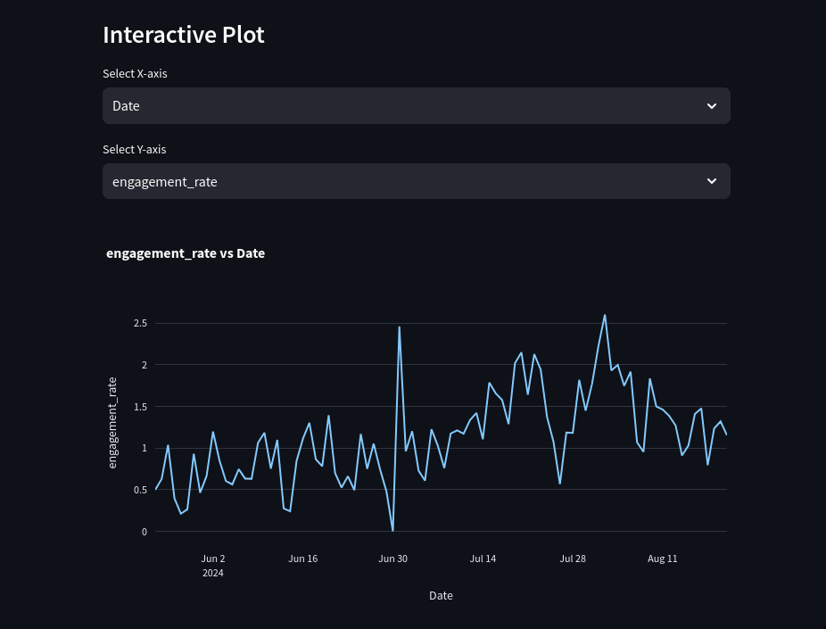

# Twitter Analytics Visualizer



## Overview
This project is a Streamlit application that visualizes Twitter analytics data. It processes CSV files exported from the Twitter Analytics Account Overview page and provides interactive plots to analyze engagement rates and other metrics.

## Features and Advantages over Twitter Analytics
This tool offers several advantages over the built-in Twitter Analytics plots:

- **Flexible Data Exploration**: Users can select any feature for both X and Y axes, allowing for custom comparisons not available in Twitter Analytics.
- **Engagement Rate Calculation**: Automatically calculates engagement rates, a metric not directly plotted in Twitter Analytics.
- **Interactive Plotting**: Utilizes Plotly for interactive, zoomable, and exportable plots.
- **Historical Data Analysis**: Easily compare metrics across different time periods by selecting the date for the X-axis.
- **Custom Metric Combinations**: Explore relationships between any two metrics of your choice.
- **Data Table View**: Displays all imported data in a table format for easy reference.

Additional features include:
- Automatic import of the most recent CSV file from the `csv_files` directory
- Calculation of engagement rates based on likes, replies, reposts, bookmarks, and impressions
- Support for any additional columns present in the Twitter Analytics CSV export

Note: While we calculate engagement rates, our method may differ slightly from Twitter's internal calculations.

## Usage
1. Place your Twitter Analytics CSV file(s) in the `csv_files` directory
2. Run the Streamlit app:
   ```
   streamlit run streamlit_app.py
   ```
3. Open the provided URL in your web browser
4. Use the interactive plot to explore your Twitter analytics data

## Data Format
The application expects CSV files with the following columns:
- Date
- Likes
- Replies
- Reposts
- Bookmarks
- Impressions

Additional columns may be present and can be used in the interactive plot.

## Contributing
Contributions to improve the application are welcome. Please feel free to submit a Pull Request.

## License
This project is licensed under the MIT License. See the [LICENSE](LICENSE) file for details.
